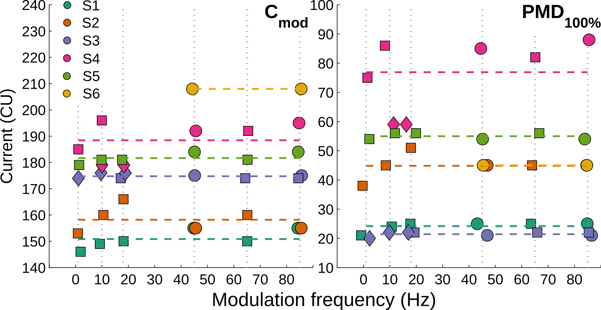
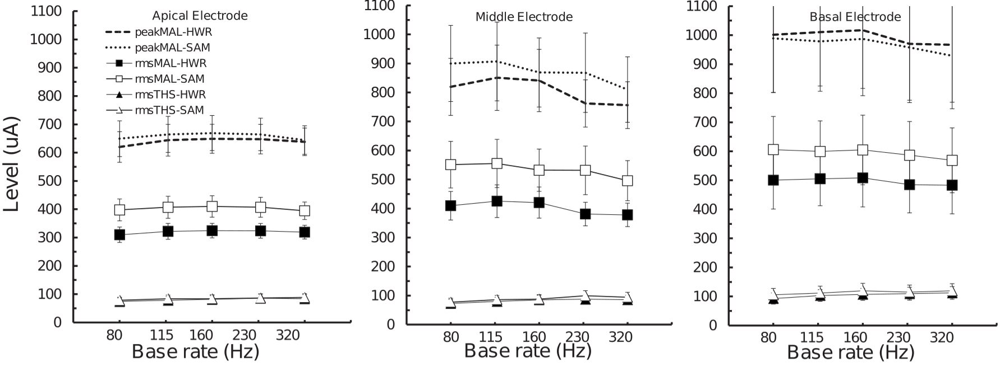
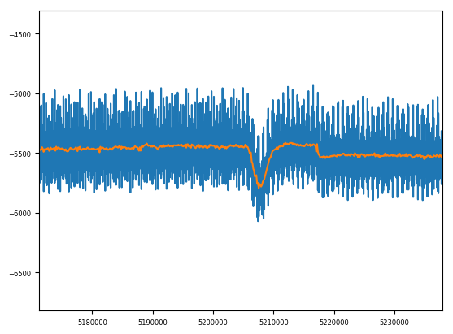

```{r setup, include=T, echo=FALSE}
knitr::opts_chunk$set(echo=FALSE, warning=FALSE, message=FALSE, kfigr.prefix=TRUE, kfigr.link=TRUE, comment=NA)
```

# Introduction

## Speech understanding  

- Cochlear implant (CI) listeners often understand speech well in quiet but poorly in the presence of noise.

- Commercial CIs convey both spectral (electrode position) and temporal cues (envelope modulations) by means of symmetric biphasic electrical pulses.

- Poor performance can be partially explained by the **limited number of independent channels** <font size="3"> (up to 7 or 8, e.g. Holmes et al., Friesen et al., 2001) </font> but also due to **poor electrode-neuron interface** <font size="3"> (Pfingst et al., 2008; Bierer and Faulkner, 2010). </font>

- Both, **spectral and temporal** cues are largely affected by current spread.


## Spread of excitation

<center>
{width="60%"}  
</center>

## Spread of excitation

<center>
{width="60%"}  
</center>

## Spread of excitation

<center>
{width="60%"}  
</center>

## Dead regions

<center>
{width="60%"}
</center>

## Dead regions

<center>
{width="60%"}  
</center>

## Dead regions

<center>
{width="60%"}  
</center>

## Why is this important? 

- Poor **electrode discrimination**, particularly in the apical and mid array, is associated with **poor speech perception** <font size="3"> (Zhang et al. 2019, Busby et al., 2000; Dawson et al., 2000; Henry et al., 2000) </font>

<!-- - Strong relationship between eACC and behavioural electrode discrimination (Mathew et al. 2017, 2018). -->

- Temporal cues, in particular, **modulation detection thresholds (MDTs)** are associated with consonant and vowel recognition <font size="3">(Fu, 2002)</font>, intonation recognition <font size="3"> (Chatterjee et al. 2008) </font>, and to word recognition and **speech reception thresholds** <font size="3"> (Won et al., 2011) </font>

- **Deactivation of electrodes in regions of poor electrode-neuron interface** is associeted to **improved performance** <font size="3"> (eg. Zhou 2019, Saleh et al., 2013; Zwolan et al., 1997). </font>

- Strong correlation between MDT and current spread has been reported <font size="3"> (Zhou et al. 2018) </font>


## Why Objective measures?

- There is a need to objectively identify poor electrode-neuron interface channels to optimize performance in CI listeners.
- Psychophysical measurements of discrimination depend on attention, cognition and linguistic ability.
- Psychophysical measurements are limited to older children and adults.


## Objective measures of spectral processing
- Recently our group has been using the electrically-evoked acoustic change complex (eACC) <font size="3">(e.g. Mathew et al. 2017, 2018) </font> to assess independency of electrode pairs in CI listeners.
- This is carried out by loudness balancing stimulating electrodes and measuring the eACC to a **change of electrode**. 

<div class="column" style="float:left; width:60%; text-align: center">
{ width="100%"}
</div>
<div class="column" style="float:right; width:40%; text-align: center">
<br>
- Strong relationship between the ACC and behavioural measures of electrode discrimination. <font size = "3"> (Mathew et al. 2017, 2018)</font>
</div>
<!-- ## Objective measures of temporal processing -->

<!-- - Electrically-evoked auditory steady-state responses (eASSR) (e.g. Luke et al. 2015) are an alternative. However, these are usually obatined either at lower stimulation rates or narrow electrode configurations to prevent artifact contamination.  -->

<!-- - An alternative is to use the electrically-evoked acoustics change complex (eACC), with the caveat the all stimuli must be loudness balanced to prevent loudness cues. -->


# Aims

## General aims

- To optimize objective measures to assess **channel independence** (or spectral resolution) in CI users.
- To develop and assess objective measures of **temporal processing** (within channel) in CI users.


# Experiment 1: Optimizing objective measures of electrode discrimination 

## Methods

<div class="column" style="float:left; width:60%; text-align: center">
**EEG**

- **Continuous stimulation** at a rate of  0.5 Hz.
- 5 CI users (Cochlear device).
- Stimuli: 826 pps; pulse width: 43 us (7us IPG); monopolar mode.
- 3 apical electrode pairs (14-15; 15-16; 16;17) 
- EEG: 64 channels Biosemi system, fs: 16384 Hz
- Artifact removal: denoising source separation (DSS) <font size="3"> (de Cheveigne and Simon, 2008) </font>

**Behavioural**

- 3I-2AFC discrimination task (400 ms; ISI 500 ms)

</div>
<br>
<br>
<br>
<div class="column" style="float:right; width:40%; text-align: rigth">

{width=100%}
</div>


## Results - slow electrode modulation (0.5Hz)

<div class="column" style="float:left; width:40%; text-align: center">

{width=100%}

</div>

<div class="column" style="float:right; width:60%; text-align: center">
<br style = “line-height:10;”>

- Clear responses obtained from all participants and all electrode pairs (10 minutues per pair)
- Behavioural discrimination significant for all participants.

</div>

<!-- ## Results - slow fast electrode mudulation (6.8 Hz) -->

<!--  -->


# Experiment 2: Envelope frequency discrimination in NH hearing


## Methods

- 6 NH 
- Stimuli: 500 Hz tone presented on the right ear (65 dB SPL).
- The envelope was partially or fully amplitude modulated. 
- The modulation frequency was alternated between 20 and 32 Hz. The switching rate of the envelope frequency was either 0.5 Hz or 6.4 Hz.
- Denoising source separation (DSS) 

<center>
{width="50%"}
</center>

## Loudness across AM rates is stable


<div class="column" style="float:left; width:43%; text-align: center">

{width="100%"}

<center> <font size="3"> (Gransier et al. 2016) </font></center>

</div>

<div class="column" style="float:right; width:57%; text-align: center">

{width="100%"}

<center><font size="3"> (Kreft et al. 2009) </font></center>

</div>

## Results - NH  - ACC (0.5Hz)


## Results - NH  - steady-state (6.4 Hz)


## Results - NH

|       NH  - ACC (0.5Hz)                      | NH  - steady-state (6.4Hz)                    |
:---------------------------------------------:|:---------------------------------------:
|{width=50%}               | {width=100%}|
|modulation index effect:- t(5) = -4.3498, p-value = 0.007  | modulation index effect: F(1,28.9) = 16.513, p-value < 0.001|

- Transient (ACC) and stady-state responses were reliably obtained.

# Experiment 3: Envelope frequency discrimination to low-rate pulse-trains in CI

## Methods

- 5 CI participants 
- CI users were simulated at 128 pps on electrode 16. 
- The envelope was amplitude modulated between threshold and comfortable level or 50% of the dynamic range. 
- The modulation frequency was alternated between 20 and 35 Hz. The rate of the modulation was either 0.5 Hz or 6.8 Hz.

<!-- {width=20%} -->
<center> {width=45%} {width=30%} </center>


## Artifact rejection
<center>
 
</center>

## Artifact rejection

<center>
 
</center>

## Artifact rejection

<center>
 
</center>

## Artifact rejection

<center>
 
</center>

## Artifact rejection

<center>
 
</center>

## Artifact rejection

<center>
 
</center>

## Artifact rejection

<center>
 
</center>

## Artifact rejection

<center>
 
</center>

## Artifact rejection

<center>
 
</center>

## Artifact rejection

<center>
 
</center>


## Results - CI  - eACC (0.5Hz)

<center>
{width="60%"}
</center>

- Weak eACC responses, clear ASSR responses to the 2 AM frequencies.
- 5/10 behavioural discrimination scores were significant


<!-- ## Results - CI  - eACC (0.5 Hz) QPC -->

<!--  -->


<!-- ##  -->
<!-- {width=40%} -->

<!-- Neither the effect of modulation depth nor polarity was significant. -->


## Results - CI  - steady-state (6.8 Hz)

<center>
{width=80%}
</center>
- No reliable responses were observed to the 6.8 Hz frequency (switching rate).

# Experiment 4: Envelope frequency discrimination to high-rate pulse-trains in CI users

## Methods

- 3 CI participants 
- CI users were stimulated with 800 pps pulse-trains on electrode 16. 
- The envelope was amplitude modulated between threshold and comfortable level or 50% of the dynamic range. 
- The modulation frequency was alternated between 20 and 35 Hz. The rate of the modulation was either 0.5 Hz or 6.8 Hz.
<center>
<center> {width=45%} {width=30%} </center>

## Results eACC (0.5Hz)

<center> 
{width="60%"}
</center>

- Reliable responses were observed at high pulse rates.
- 6/6 behavioural discrimination scores were significant


<!-- ## Results eACC (7Hz) -->

<!--  -->

## Summary

- Clear and reliable responses can be obtained using a continuous eACC paradigm (0.5 Hz) to electrode or AM changes. 

- NH listeners showed clear ACC and steady-state responses to AM frequency changes with a rapid response reduction at 50%. 

- CI responses to lower pulse rates were more variable but still clear at both 50% and 100% modulation depth. 

- All CI participants showed good responses for slow switching rates but not for the high switching rate. This may suggest adaptation effects.

- eACC responses to 800 pps did not change in amplitude when the modulation depth was reduced from 100% and 50%.

## ACKNOWLEDGEMENTS

- Thank you and all participants.

<br />
<center>
{width="20%"}{width="20%"}{width="20%"}
</center>


|MRC Senior Fellowship in Hearing Research (MR/S002537/1)|Australian Research Council (FL160100108) |
:---------------------------------------------:|:---------------------------------------:
|{width=40%}|{width=40%}|
  


